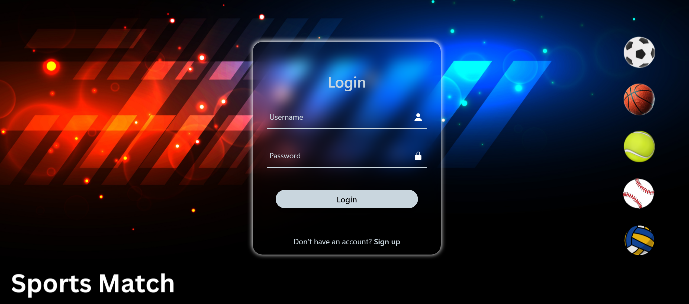
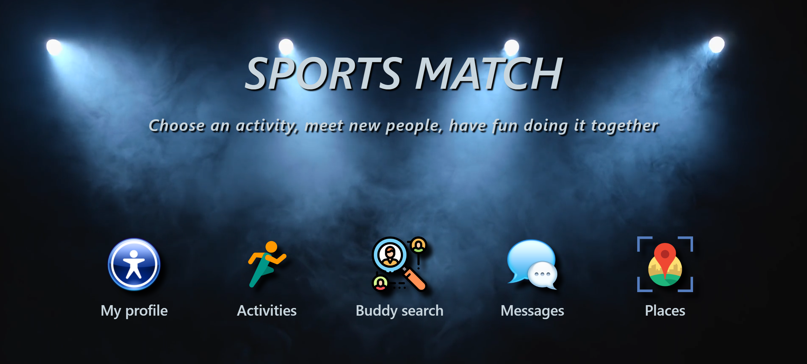

Update: 
Planned incoming additions/changes:
1. Making the site responsive. (in progress)
2. Overall design changes. (in progress)
3. Adding MongoDB database. (in progress)
4. Implementing new chat features. (in progress)

This is my own project idea for a website that helps people with common interests in different sports to meet and play together. The website also provides an opportunity to choose the most convenient places for practicing the desired sport in the respective city/neighborhood.

## User guide
1. Edit your profile.
2. Add your favorite activities, so other people who share your passion can find you.
3. Use the buddy search option to find new friends and play your favorite sport together.
4. Start a chat and discuss the details.
5. Use the catalogue to find new sport places in your city.

## Available Scripts

In the project directory, you can run:

### `npm install`
### `npm start`

Runs the app in the development mode.\
Open this link [http://localhost:3000](http://localhost:3000) to view it in your browser.

The page will reload when you make changes.\
