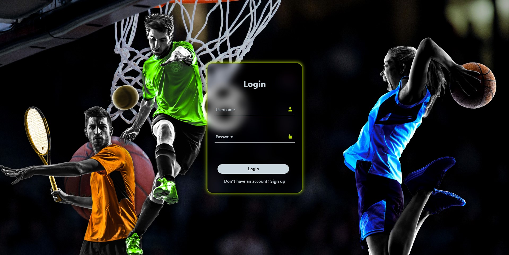
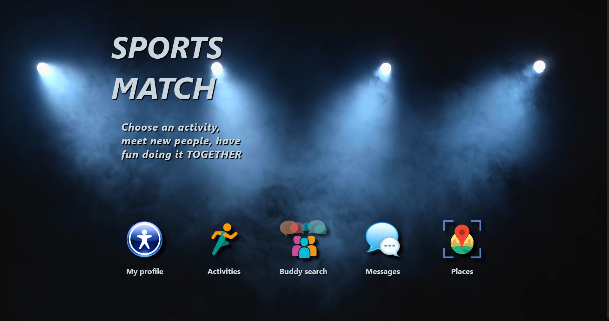
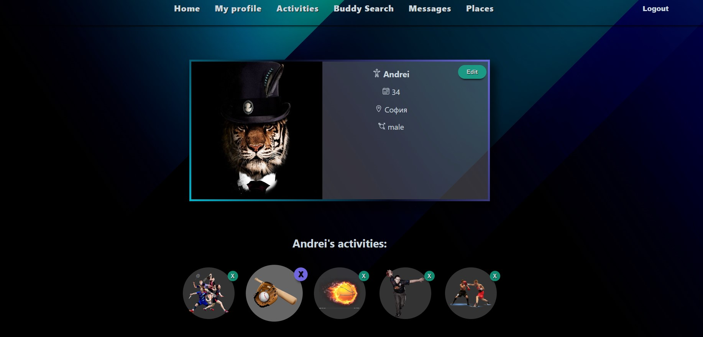
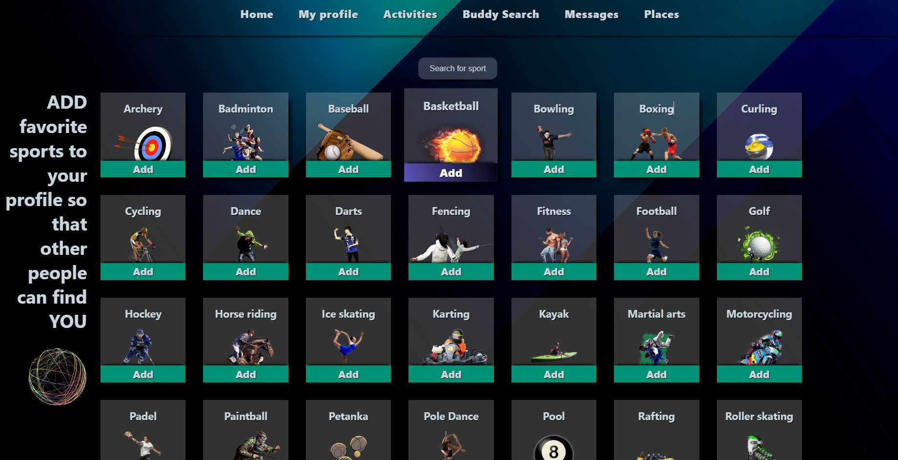
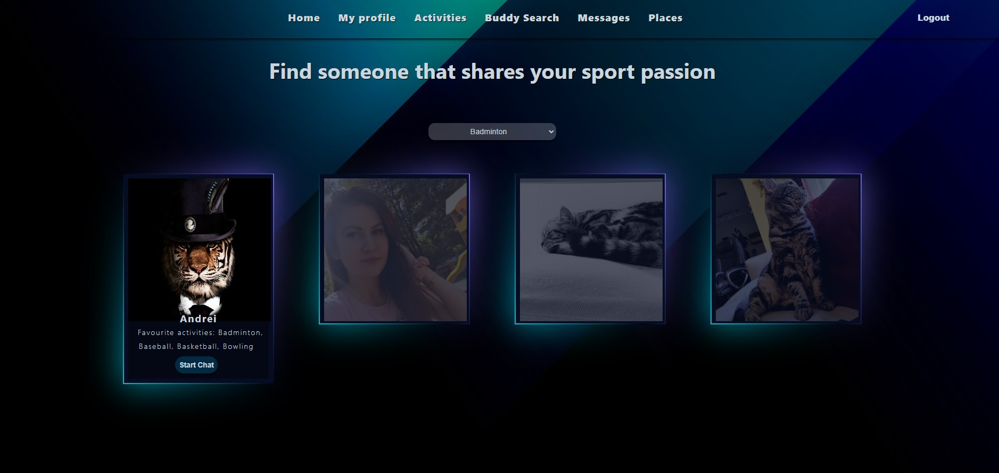
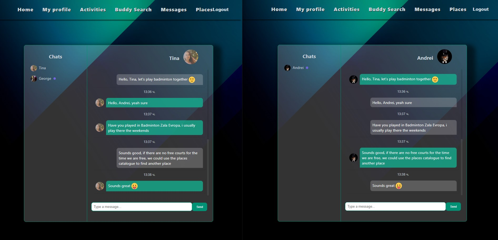
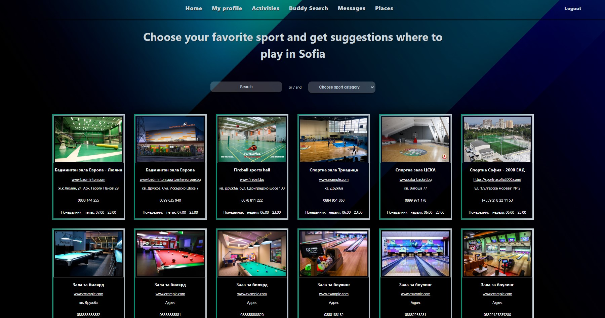

This is my own project idea created in collaboration with my colleague Tina Groshkova.
It is our final project from the IT talents training camp 2023.

## User guide
1. Edit your profile.
2. Add your favorite activities, so other people who share your passion can find you.
3. Use the buddy search option to find new friends and play your favorite sport together.
4. Start a chat and discuss the details.
5. Use the catalogue to find new sport places in your city.

## Available Scripts

In the project directory, you can run:

### `npm install`
### `npm start`

Runs the app in the development mode.\
Open [http://localhost:3000](http://localhost:3000) to view it in your browser.

The page will reload when you make changes.\
